# EU Green Deal Reporting
## Harvard Software Engineering Capstone Project (CSCI E599)
Group Project: Mark McDonald, Alan Martinson, Carly Gloge, Hemanyt Bajpai, Pritam Dey, Taylor Meyer

The following slides are from the final project presentation of this project to the Capstone Faculty Panel as part of the graduate program final project deliverable.

This was a complex project built collaboratively with a team of 6 fellow graduate students.  The requirements for the project were developed in coordination with Data Science staff at the European Commission.

[Link to Technical Paper (pdf)](EU_Green_Deal_Paper_Final.pdf)

[Link to Application Setup Guide (pdf)](READEME_APPLICATION_GUIDE.pdf)

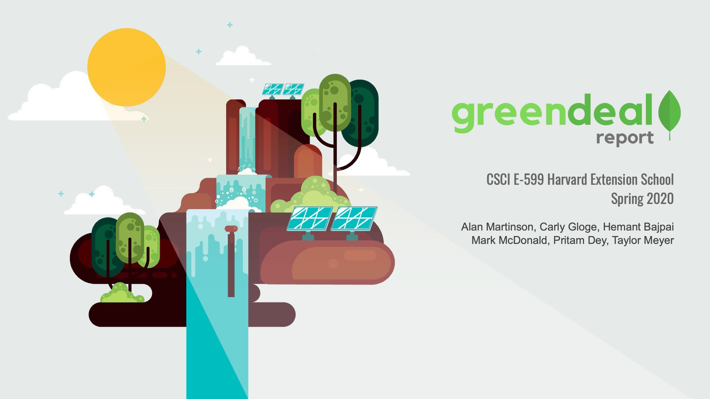
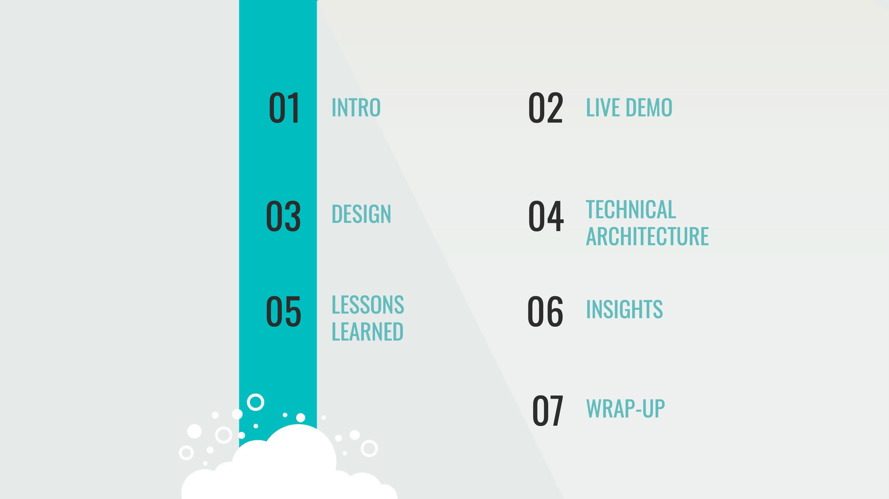
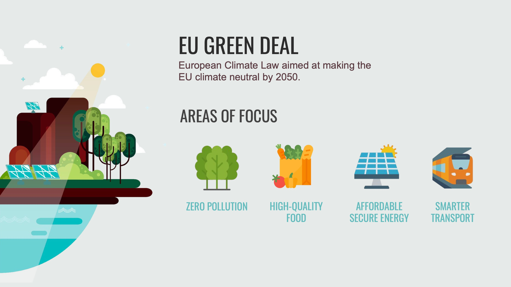
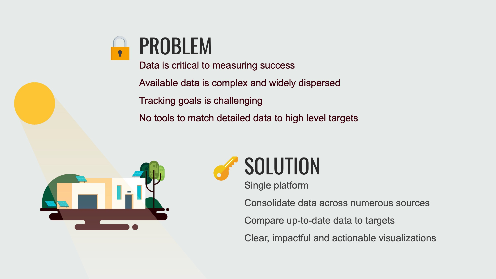
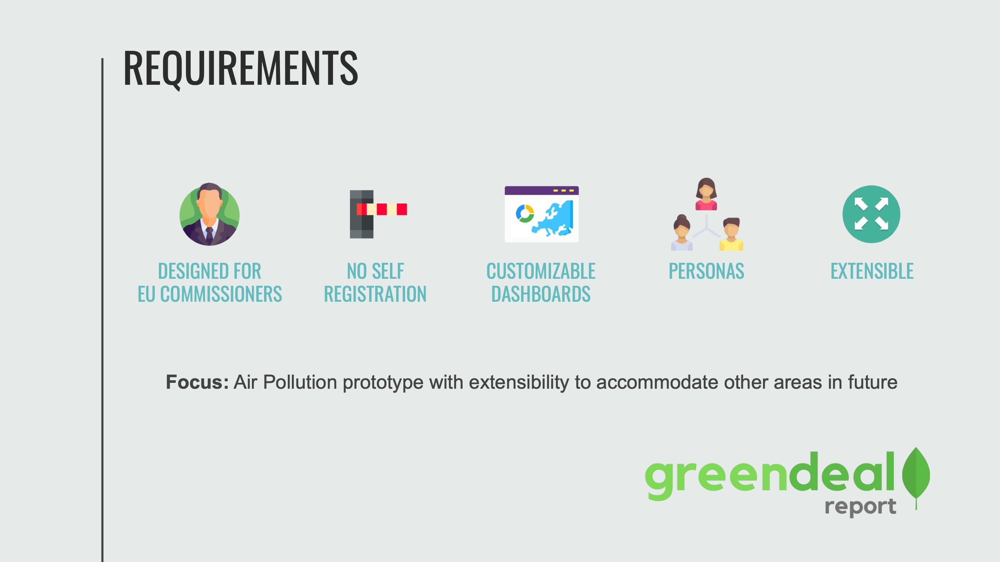
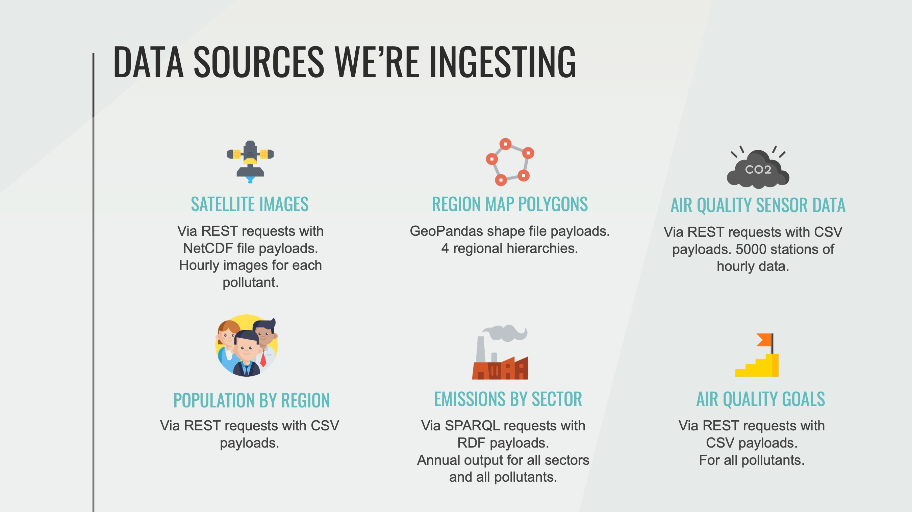
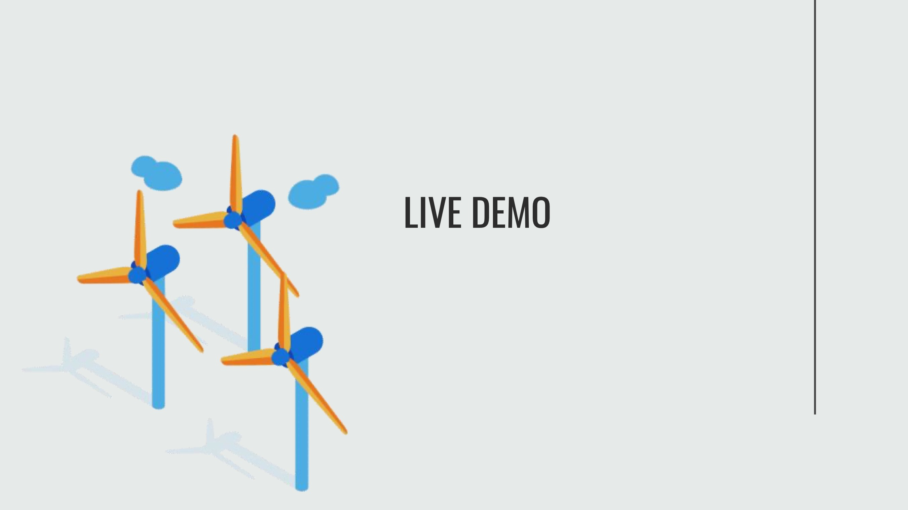
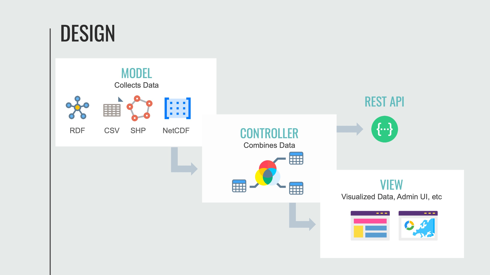
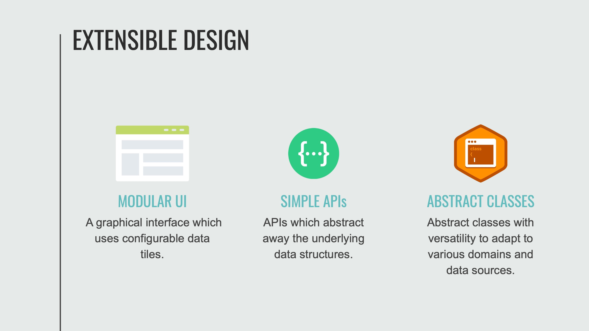
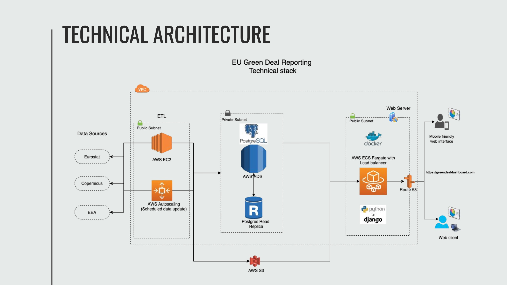
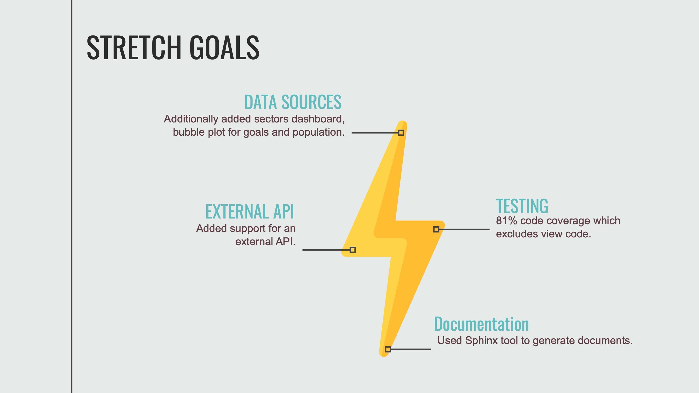
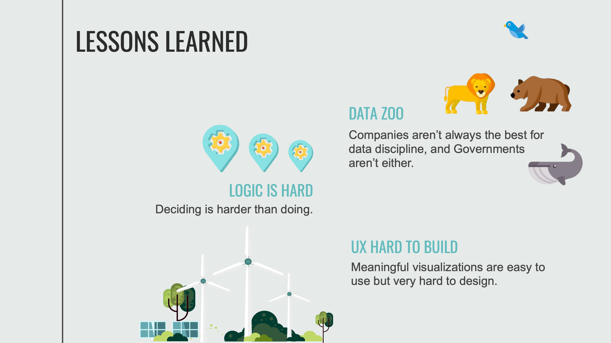
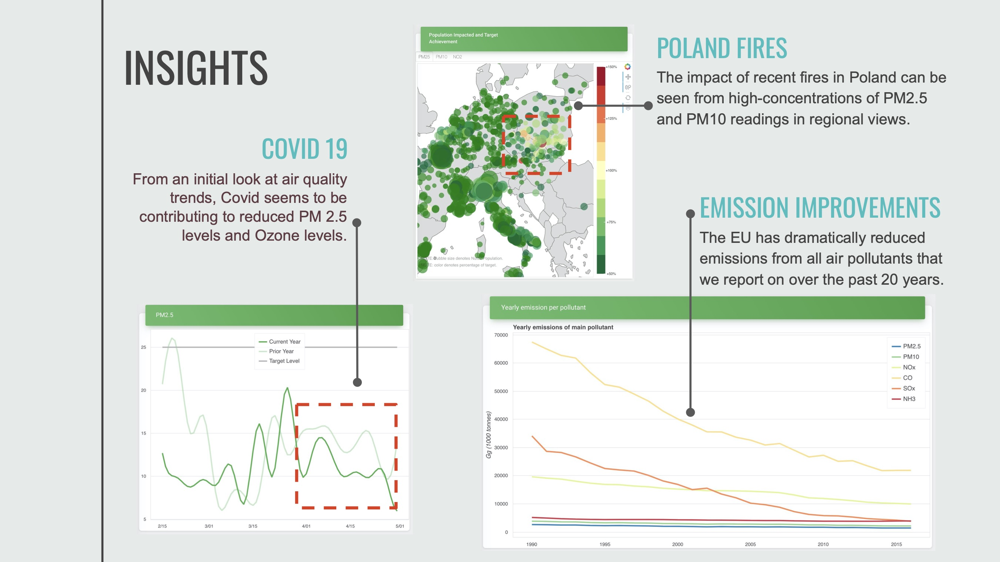
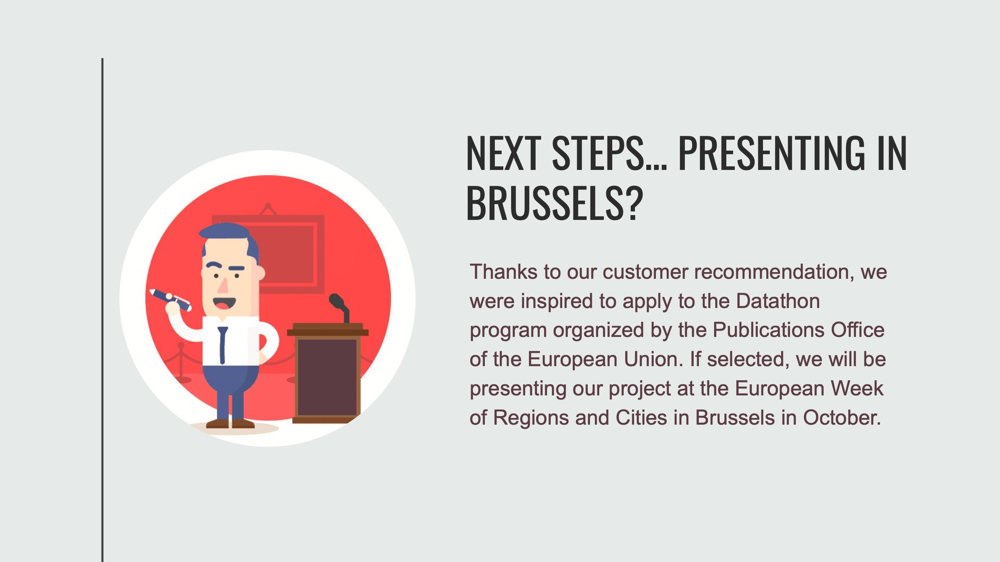
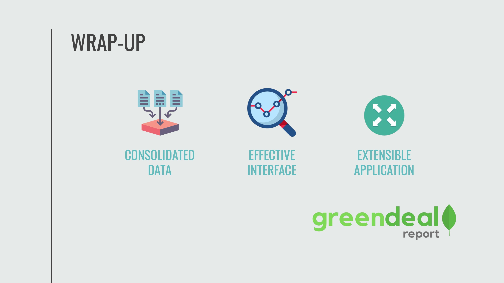
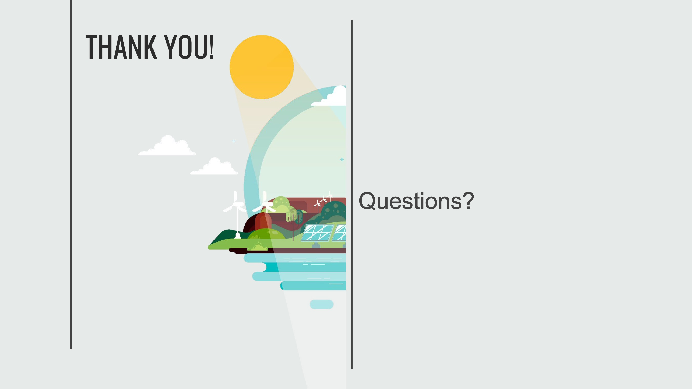

